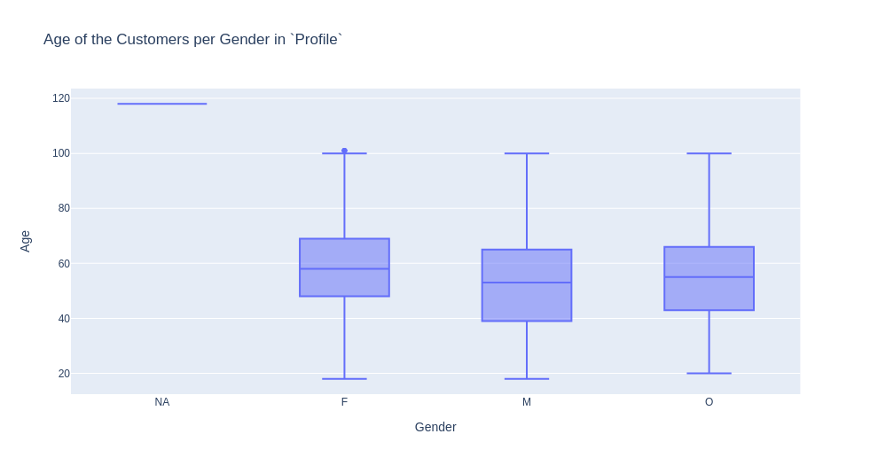

# Formative Assessment
Febuary 21, 2022\
by Gabriel Berardi, Mickael Bastard and Felix von Wendorff

## Introduction
A cornerstone of every successful business is identifying potential customers, informing them of your service or product and hoping they become a customer. This process is called marketing. However, customers are complex and not all people are potential customers. The solution is targeted marketing; segmenting the population into distinct groups and approaching the ones most interested in the service. The emergence of internet advertainment has allowed for companies to target potential customers with greater precision than ever before. Data is now collected on advertisement conversion ratios allowing companies to know exactly how successful a marketing campaign was.\
The goal of this project is to segment a population of customers into categories based on what promotion they respond best to and identify the ideal promotion for each customer.  This project will attempt to cluster the customers into 11 groups, one for each promotion and one group for customers who do not respond to promotions.

*An alternative to this approach would be to cluster customers into 3 groups, one for each offer type, if no significant patterns emerged from the former analysis given that 11 groups might be too many for the studied data sample (Mickael)*.

This is because a company should only market to those individuals where it believes it makes sense to promote to.

## Data
Three files are provided as data input: `portfolio`, `profile` and `transcript`. `portfolio` is a list of ten promotions that can be used to target the customers.  
The customers are listed in the `profile` data set and the `transactions` are listed in the `transcript` data set.

## Data Exploration
A total of 17,000 customers are identified in this project. Because the assignment is to subdivide the customers into distinct groups, the main goal is to have as much information about each customer as possible. By using the customer ID as a unique key, it is possible to link each customer to their transactions in the transaction data set and determine the total revenue generated from each customer.\
An immediate anomaly is that 2,175 individuals are listed as having an age of 118. These individuals do not have additional information available about them such as income or gender. It seems unlikely that this many 118 year old’s are customers and suggest that this is the default value if age data is not given.  However, transactions are recorded so that it seems that these individuals are real people where the complete data about them is not known. Customers with an age of 118 do spend less and are a statistically distinct group. TO DO: T_TEST.\

\
Of the total 17,000, 422 have no recorded transactions, 4226 customers never responded to an offer, 6 did not receive any offers and 166 did not view any offer. 

## Data Cleaning - Outlier Detection and Missing Values
Successfully detecting outliers is a crucial step in any clustering project. For the purpose of this project, we defined outliers as datapoints lying outside the upper (Q3 + (1.5 * IQR)) and lower fence (Q1 – (1.5 * IQR)). Looking at the three datasets, we detected the following outliers:

### Portfolio
The portfolio dataset merely lists the ten different promotions and hence does not contain any outliers or missing values.

### Profile
In the profile dataset, we identified the following outliers:

**Age**\
The only outlier seems to be the age of 118. However, this corresponds to people where no gender and no income is recorded and could therefore be a systematic error, e.g. customers who chose to not disclose their age, gender and income. We decided to treat these entries as missing values and will impute values for these customers or remove these entries later on. When looking at the age per gender, there seem to be outliers for female customers where the age is 101:

However, these values are so close to the upper fence of the boxplot that we decided to keep these customers in the dataset.

**Income**\
When aggregated, there seems to be no outlier in terms of the income of the customers. However, when splitting the customers up by gender, there seem to be some outliers for male customers:

Similar to the outliers in the `age` column, these data points are so close to the upper fence and are still in a reasonable range that we decided to keep these entries.

### Transcript
In the transcript dataset we identified that the `amount` column is a highly right-skewed distribution with an extremely long tail:

However, the `transcript` dataset contains many transactions where the amount is equal to zero, in cases where an offer is received, viewed or completed. When we ignore these entries (i.e. only consider the trancation's event) and zoom in on this, the distribution looks like this:

The figure above shows a bimodal distribution with one first peak around 1.15\\$ and another peak around 14.5\\$. One interpretation is that we have two groups of customers:
* one first group which is more likely to spend 1.15\\$ on average
* another group which is more likely to spend 14.5\\$ on average

From the structure of the data (e.g. "buy one get one" campaign type), we assume that the data stems from a retail food and beverage company and that high amount transactions could stem from large group orders or catering activities. Therefore, we will treat the `transcript` dataset as legitimate.

## Variables of Interest
After the total revenue per customer has been determined, it is possible to calculate the average revenue per year. This is important because it allows a long-term customer and a new customer to be compared in a fair manner.\
Another potential variable is the duration a customer has been a member. \
Finally, the number of transactions a customer initiated or the number of  promotions a customer responded to could be an additional variable. By plotting two of these variables on a Cartesian plane, it is possible to segment them.

*(Mickael) Here are other potential variables that might be important to consider:*
* *The total average spend per customer to know how much the clients spend on average over the promotional period. Instead of considering the entire promotional period, we could also derive the average spend per year.*
* *The transaction frequency (i.e. same as the number of transaction - 1) represents the average of times the customers have returned over the promotional period. For this case study, we may also use periods of weeks or months if the promotional period appears to be too long.*
* *The transaction recency represents the duration between a customer's first purchase and their latest purchase. This variable might help separating inactive customers who made a purchase a long time ago (i.e. high recency) to active customer with low recency. Once the two groups have been identified, the company can either decide to re-engage with dormant customers or to focus its attention on active customers in order to retain them. Another approach might consist in flagging customers that were active (i.e. low recency) and became suddently inactive (e.g. high recency). Then, the company could create a targeted reactivation compaign towards these flagged customers by sending them some offers. The challenge with this approach is that it requires to derive some time dependent recency variable. 

## Clustering Methodology
Two types of clustering were considered in this project: principal component analysis (PCA) and K-Means clustering. K-means analysis allows groups to appear in the scatterplot while PCA would enable the researchers to determine if a specific customer fits to an offer. 
