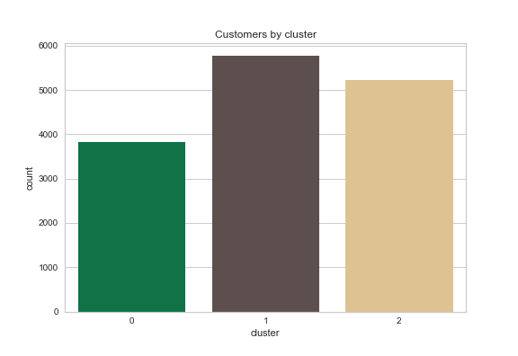
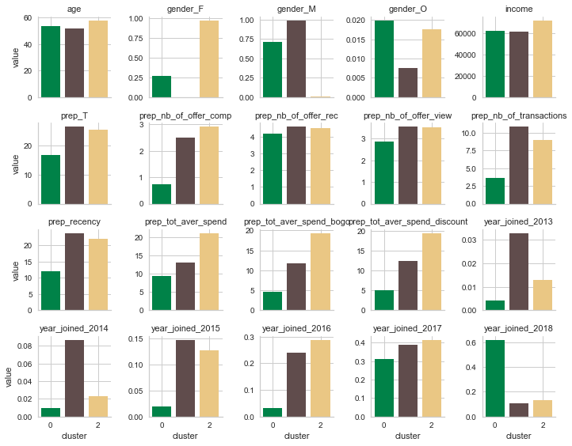

# Evaluation and Interpretation

## Customers by cluster

## Interpetation of the clusters

### Yellow Group - Women who spend a lot and complete a lot of offers
* Mainly Wpomen (almost 100%)
* 2 to 4 years of seniority
* High recency (More than 20 days)
* High total average spend (i.e. around 20 dollars)
* High total average spend on bogo and discount offers (i.e. around 20 dollars)
* High number of offer completed (i.e. around 3)
* High number of transactions (i.e. more than 7)

### Green Group - Mostly men not completing offers, and spending less when they use offers, who joined less than 2 years ago (i.e. low seniority)
* Mainly Men (75% of men and 25% of women)
* Joined lately in 2017 and 2018 (90% of them)
* Low recency (about 10 days) --> joined less than 2 years ago
* Low total average spend (i.e. less than 10 dollar)
* Low total average spend on bogo and discount (i.e. 5 dollar)
* --> spend less when they use bogo and discount offers (5<10)
* Low number of offer completed (i.e. less than one)
* Low number of transactions (i.e. around 3)

### Brown Group - Men spending on average always the same even if they do not receive offers
* Mainly Men (almost 100%)
* Has more than one year seniority
* High recency (More than 20 days)
* Medium total average spend (i.e. around 12 dollars)
* Medium total average spend on bogo and discount offers (i.e. around 12 dollars)
* --> Spend the same when they complete bogo and discount offers
* Medium number of offer completed (i.e. around 2.5)
* High number of transactions (i.e. more than 10)