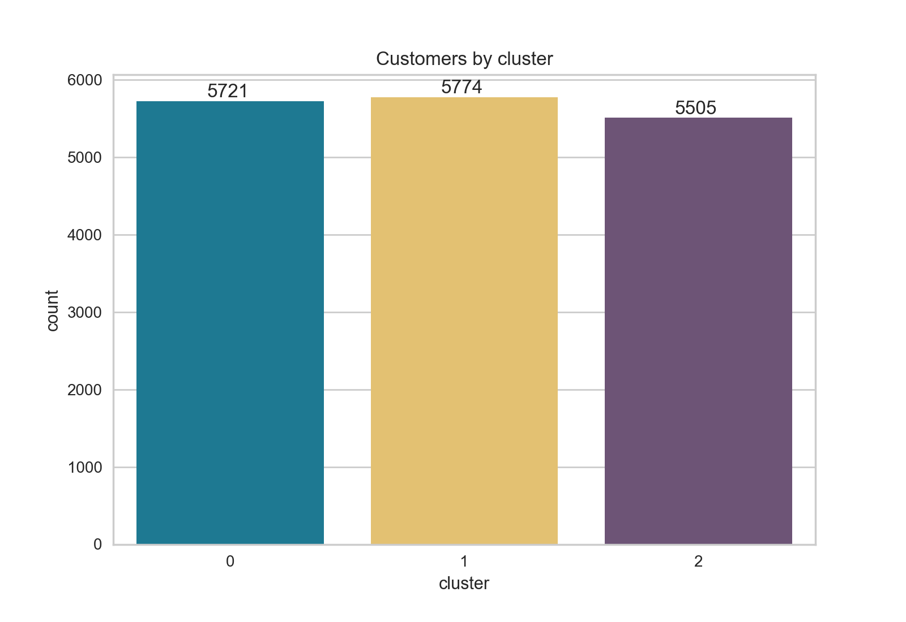
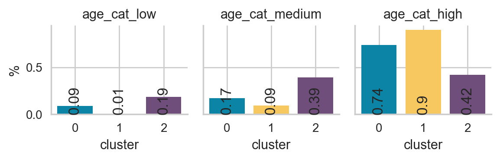
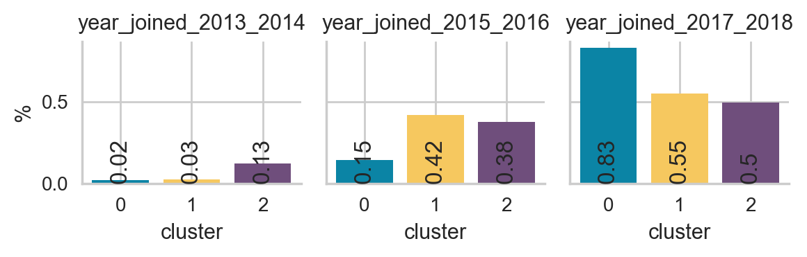
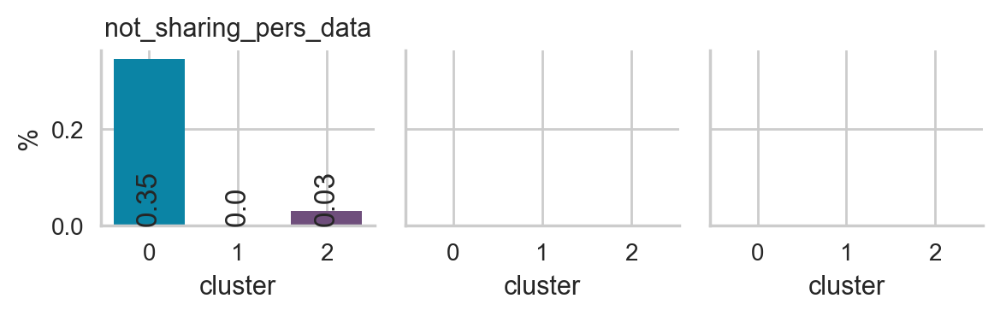
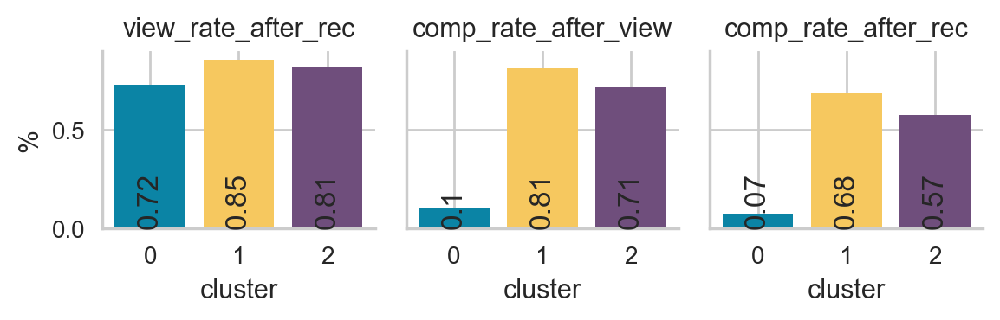
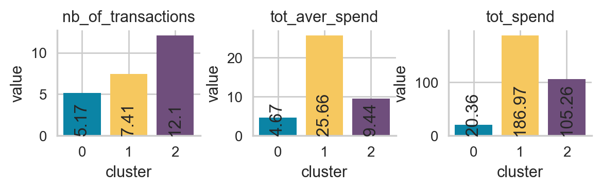
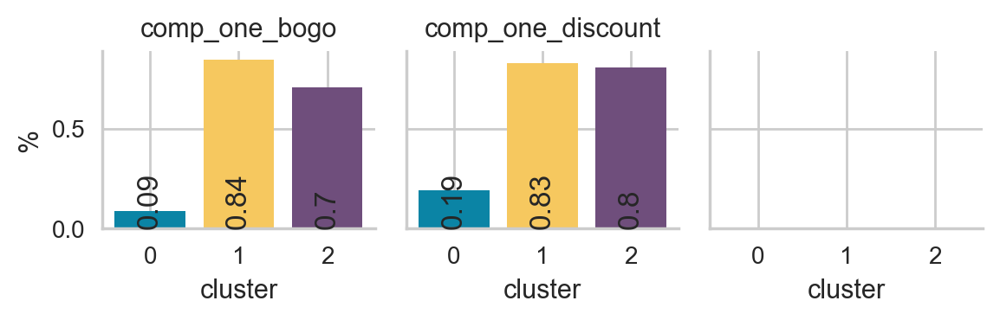
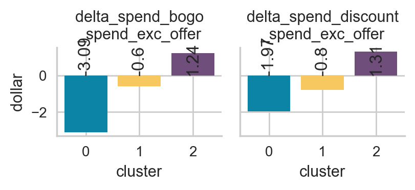

# Evaluation and Interpretation

## Derived informative variables

These informative variables are derived while calling the preprocessing() function in the utils/utils_main.py file

* prep_tot_aver_spend (same as monetary value) : TOTAL AVERAGE SPEND PER CUSTOMER
* prep_tot_aver_spend_discount : TOTAL AVERAGE SPEND ON DISCOUNT OFFERS PER CUSTOMER
* prep_tot_aver_spend_bogo : TOTAL AVERAGE SPEND ON BOGO OFFERS PER CUSTOMER
* prep_tot_aver_spend_exc_offers : TOTAL AVERAGE SPEND EXCLUDING OFFERS PER CUSTOMER (i.e. average amount of transactions that have nothing to do with offers)
* prep_tot_spend : TOTAL SPEND PER CUSTOMER
* prep_tot_aver_reward : TOTAL AVERAGE REWARD ON COMPLETED OFFERS PER CUSTOMER
* prep_nb_of_offer_rec : NUMBER OF OFFER RECEIVED OVER THE SET PROMOTION PERIOD
* prep_nb_of_offer_view : NUMBER OF OFFER VIEWED OVER THE SET PROMOTION PERIOD 
* prep_nb_of_offer_comp : TOTAL NUMBER OF COMPLETED OFFER OVER THE SET PROMOTION PERIOD
* prep_nb_of_transactions (same as frequency + 1) : NUMBER OF TRANSACTIONS OVER THE SET PROMOTION PERIOD
* prep_recency : age of the customer when they made their most recent purchases in number of days. This is equal to the duration between a customer’s first purchase and their latest purchase. (Thus if they have made only 1 purchase, the recency is 0. If they have made no purchase, the recency is -1)
* prep_T : age of the customer in days. This is equal to the duration between a customer’s first purchase and the end of the period under study. (If they have made no purchase, the recency is -1)
* view_rate_after_rec : % of offers that have been viewed after receiving it = prep_nb_of_offer_view/prep_nb_of_offer_rec
* comp_rate_after_view : % of offers that have been completed after viewing it = prep_nb_of_offer_comp/prep_nb_of_offer_view
* comp_rate_after_rec : % of offers that have been completed after receiving it = prep_nb_of_offer_comp/prep_nb_of_offer_rec
* prep_comp_one_discount : COMPLETED AT LEAST ONE DISCOUNT OFFER (Boolean: 0 (NO) / 1 (YES))
* prep_comp_one_bogo : COMPLETED AT LEAST ONE GOGO OFFER (Boolean: 0 (NO) / 1 (YES))

## Variables used for the modelling

* prep_tot_aver_spend_exc_offers    
* prep_tot_aver_reward              
* prep_tot_aver_spend_bogo          
* prep_tot_aver_spend_discount      
* prep_recency                      
* prep_T                            
* prep_nb_of_transactions           
* prep_tot_spend                    
* prep_tot_aver_spend               
* view_rate_after_rec               
* comp_rate_after_view              
* comp_rate_after_rec               
* gender_F                          
* gender_M                          
* gender_O                          
* year_joined_2013_2014             
* year_joined_2015_2016             
* year_joined_2017_2018             
* age_cat_high                      
* age_cat_low                       
* age_cat_medium                    
* income_cat_high                   
* income_cat_low                    
* income_cat_medium 

## Variables used for the interpretation

* gap_spend_bogo_spend_exc_offer = prep_tot_aver_spend_bogo - prep_tot_aver_spend_exc_offers
* gap_spend_exc_discount_spend_exc_offer = prep_tot_aver_spend_discount - prep_tot_aver_spend_exc_offers

## Modeling using K-Means

## Customers by cluster

## Interpetation of the clusters

### Yello Group - Mostly Women with high income who spend a lot and complete a lot of offers
* Mostly Women (65% Women + 35% Men)
* Mostly Old People (90%)
* Mostly High income (83%)
* Low and Medium seniority (joined mostly between 2015 and 2018)
* High view rate (i.e. 86 %)
* High completion rate after receiving offers (i.e. 68%)
* Medium number of transactions (i.e. 7.4)
* High total average spend (25.66 dollar)
* High total spend (186.97 dollar)
* Most have completed at least one bogo and discount offer (84% and 83% respectively)
* Spend slightly less on average while using bogo and discount offers. Spend even less when using discount offers. 

This group spent the most over the promotional period with a total spend of 191.39 dollar on average and a total average spend of 25.94 dollar on average. 

This group responds very well to promotionnal offers with a view rate of 86% and completion rate of 69 %.
We should keep sending promotionnals offers to this group.

However, this group spends slightly less on average while using bogo and discount offers. It spends even less when using discount offers. Therefore, we might want to send more bogo offers to reduce the cost of the promotional campaign.

### Purple Group - Mostly Men with low income who make a lot of transactions and spend more while completing offers
* Mostly Men (70% Men + 30% Women)
* Mostly middle age people and old people (38% + 43%)
* Mostly low income (57%) and medium income (34%)
* Low and Medium seniority (joined mostly between 2015 and 2018)
* High view rate (i.e. 82 %)
* Relatively high completion rate after receiving offers (i.e. 57%)
* High number of transactions (i.e. 12.5)
* Medium total average spend (9.44 dollar)
* High total spend (105.26 dollar)
* Most have completed at least one bogo and discount offer (70% and 80% respectively)
* Spend more on average while using bogo and discount offers. Spend slightly more when using discount offers. 

This group completed the highest number of transactions over the promotional period with 12.46 transactions on average.

This group responds also very well to promotionnal offers with a view rate of 82% and a completion rate of 57 %.
We should keep sending promotionnals offers to this group.

This group spends even more on average while completing offers (i.e. discount and bogo). This group completed more discount offers than bogo offers on verage and this group spends slightly more while completing discount offers. Therefore, we might want to send more discount offers to this group as they seem to be more responsive and they tend to spend more with this kind of promotion.

### Blue Group - Mostly men with medium income and low seniority who spend very little and even less while completing offers
* Moslty Men (67% of men and 33% of women)
* Mostly Old People (74%)
* Mostly medium income (54%) and low income (34%)
* Low seniority (joined mostly in 2017 and 2018)
* 35% of this group did not want to share their personal data (i.e. almost all the people who did want to share their personal data belong to this group)
* Relatively High view rate (i.e. 72 %)
* Very low completion rate after receiving offers (i.e. 7%)
* Low total average spend (4.67 dollar)
* Low total spend (20.36 dollar)
* Spend less on average while completing bogo and discount offers. Spend even less while completing bogo offers

This group completeted the lowest number of transactions over the promotional period with 5.17 transactions on average.

This group spent the least over the promotional period with a total spend of 20.36 dollar on average and a total average spend of 4.67 dollar on average. 

This group does not respond to promotionnal offers with a completion rate of 7 %.
We should stop sending promotionnals offers to this group.

Moreover, this group spends less on average while completing offers (i.e. discount and bogo) which means that it costs money for the company.
